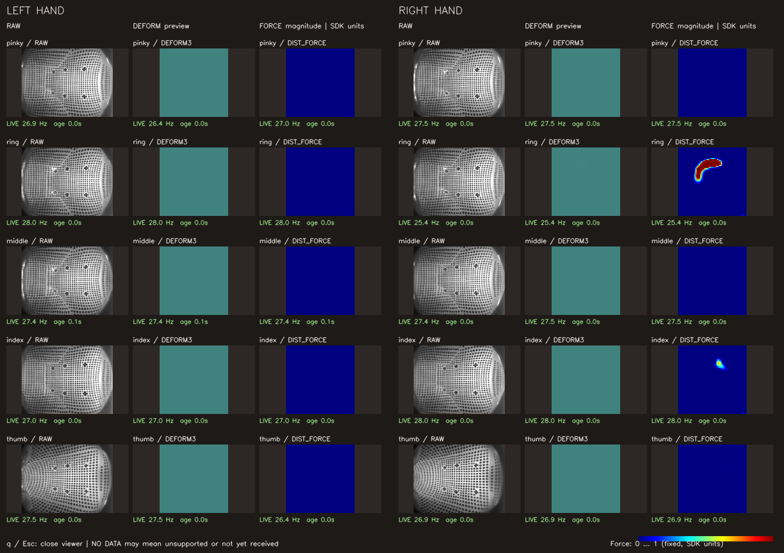

# Sharpa tactile 資料讀取調查

調查日期：2026-09-29。

## 結論

已完成第一版 tactile 讀取、ROS Image 發布與 OpenCV viewer，並完成雙手實機讀取驗證。沿用既有 Sharpa SDK session，不另建手部控制連線；未加入錄製或 RViz。

已確認的方向是 **minimum effort：先啟動既有 launch，再執行一支 Python viewer，用 OpenCV 看雙手 tactile**。`hand_node` 沿用自己的 SDK 連線讀取並發布資料，viewer 只訂閱 ROS topics。正式使用時，首次資料格式盤點放在同一條讀取路徑的 log 中，不需額外 probe 程式或第二套 SDK session。詳細方案見第 8 節。

第一版以每指約 30 Hz 的板端推理為目標，提供原圖、形變圖和分布力熱圖。不做 RViz 投影、錄製、自訂 ROS message 或額外控制介面。不要把關節的 100 Hz 發布率當成 tactile 感測率，也不要先假設實機一定有 `DIST_FORCE`。

**目前可使用第 8 節的 launch + viewer 指令；實機測試結果、畫面與限制見第 12 節。這次未發送 motion command、未校正、未更新韌體。**

以下保留 SDK 調查依據，並更新實測發現。正式流程的 read_only 模式禁止 motion；首次資料盤點另使用暫存測試工具驗證 SDK 呼叫白名單，工具不屬於日常使用流程。

### 現場狀態與測試授權（2026-09-29 更新）

使用者已確認 Sharpa 手接上，**允許進行資料讀取測試，但禁止下任何 motion command**。

- 可進行 SDK discovery、裝置資訊／能力查詢、為讀取 tactile 所需的連線與接收啟停，以及 tactile／關節回授讀取、資料格式與接收率檢查。
- 不得發送關節位置、速度、力矩或其他運動目標；包含全零、default pose、保持目前姿勢的目標，以及任何小幅測試動作。不能因為「只動一點」或「目標等於目前位置」就視為讀取。
- 不執行 GUI 控制、sine／step、回到 default pose 或 SDK motion example；不向 `/sharpa/{left,right}_hand/joint_command` 發布訊息。
- 讀取測試不自動執行 tactile tare、關節校正或韌體更新。先確認收流與原始資料；校正不屬於這次資料讀取測試。
- SDK `connect()`／`start()` 可能初始化感測與時間同步；使用前檢查呼叫路徑不含 motion command。一般控制模式的 `SharpaSdkHand.start()` 會設定關節模式、來源及係數；新增的 `read_only:=true` 會跳過這些 setter，並取消 motion subscription。
- 本次已依此授權完成讀取測試。serial、API、shape/dtype、更新率及「未發送 motion command」紀錄見第 12 節。

## 1. 調查範圍與版本

此處將「dual_sharpa_project」對應到目前實際使用的 repository：

| 項目 | 本機位置／版本 |
| --- | --- |
| 雙手 ROS 專案 | `/home/msc-crx/ws_fanuc/src/dual_sharpa_wave_ros2` |
| ROS package | `dual_sharpa_wave` |
| 調查時 Git HEAD | `main`，`69668ec` |
| SDK | `/opt/sharpa-wave-sdk` |
| SDK VERSION / BUILD_ID | `5.0.10` / `5.0.10.6` |
| SDK INFER_ENGINE | `none`（VERSION 記錄） |
| Python 核對 | `/usr/bin/python3`，載入 `/opt/sharpa-wave-sdk/python/sharpa/__init__.py` |
| 韌體紀錄 | 本次 SDK discovery/startup log 確認兩手皆為 `3.0.10` |

`docs/hardware.md` 有未提交的現場診斷紀錄，本次保留原樣。該文件開頭仍寫「未完成實機連線」，但 README 與 `realrobotplan.md` 已記錄雙手關節回授和控制成功；這些是不同時間的紀錄，不能用舊段落判斷今天的裝置狀態。

## 2. 現有專案如何連接雙手

主要來源：

- [sharpa_sdk_hand.py](../dual_sharpa_wave/sharpa_sdk_hand.py)：指定 serial 連線、啟停、關節讀寫。
- [hand_interface.py](../dual_sharpa_wave/hand_interface.py)：關節／生命週期介面及可選的 tactile frame 取出介面。
- [hand_node.py](../dual_sharpa_wave/hand_node.py)：ROS 關節 topic 與 timer。
- [dual_sharpa.launch.py](../launch/dual_sharpa.launch.py)：左右手各自一個 node process。
- [dual_sharpa_hardware.yaml](../config/dual_sharpa_hardware.yaml)：硬體參數。

| 手 | serial | 既有 IP 紀錄 | ROS namespace | tactile 指尖 channel |
| --- | --- | --- | --- | --- |
| 左手 | `CD52943BCD53` | `192.168.10.10` | `/sharpa/left_hand` | 5–9 |
| 右手 | `C956943BC957` | `192.168.10.20` | `/sharpa/right_hand` | 0–4 |

目前 `SharpaSdkHand.start()` 流程：

1. lazy import `sharpa`，取得 manager，等待指定 serial。
2. `manager.connect(self.serial_number)`。
3. tactile 啟用時核對左右手與支援能力、註冊 callback；一般模式設定 `POSITION`、speed/current coefficient、`ControlSource.SDK`，read_only 模式跳過關節設定。
4. `hand.start()`，檢查回傳 bool；tactile 啟用時另檢查 `is_tactile_ready()`。
5. 讀一次關節位置，之後由 ROS timer 以設定的 100 Hz 讀取及發布。

`connect()` 沒有傳 `skip_tactile`，而 SDK 預設是 `False`，所以目前程式**沒有明確停用 tactile 初始化**。本次新增 callback、ready 檢查與首次格式 log；仍應以實際持續收到的 frame 判斷各指收流，不能只看 `joint_states`。

硬體 `command_timeout_sec` 為 `0.0`，沒有動作指令時 session 仍會維持。讀取 tactile 時使用 `read_only:=true`，不建立關節指令 subscription，adapter 也會拒絕 motion target。

## 3. 已核對的 Python API

下表來自本機 Python native extension 的實際匯出與 docstring，並對照 SDK header/sample。檢查時沒有建立裝置物件。

| API | 用途與注意事項 |
| --- | --- |
| `manager.connect(serial, skip_tactile=False)` | 指定手並允許 tactile 初始化；不可設定成 `True` 後還期待讀到 tactile |
| `manager.connect(serial, config)` | 接受 `SharpaWaveConfig` 的 overload |
| `SharpaWaveConfig.tactile_config_file` | 指定 tactile pipeline JSON；空字串使用預設值 |
| `SharpaWaveConfig.disable_tactile` | 停用 tactile 初始化開關 |
| `SharpaWaveConfig.disable_sync_time` | 啟動時間同步開關；首版保留預設 |
| `wave.get_device_info().has_fingertip_tactile()` | Python 可用的指尖 tactile 支援能力查詢 |
| `wave.get_hand_variant()` | `normal`、`se` 或 `unknown`；docstring 指查詢失敗可 fallback 成 `normal`，不能單靠它證明手型 |
| `wave.start()` / `wave.stop()` | 官方 tactile 範例使用的 session 啟停，回傳 bool |
| `wave.is_tactile_ready()` | 檢查 tactile ready；仍需看各 channel 是否持續有 frame |
| `wave.fetch_tactile_frame(channel, timeout=0.0)` | polling；範例處理 dict 或 `None`，timeout 單位秒 |
| `wave.set_tactile_callback(callback, max_deliver_hz=0.0, omit_raw=False)` | callback 收到 compact frame dict；預設每 frame 都交付、保留 RAW |
| `wave.tactile_summary()` | 接收統計 JSON 字串，header 說明包含封包／frame 收到、遺失及起始時間 |
| `wave.calib_tactile(num_frames=20, max_retry=10)` | tactile tare／零點校正，回傳 bool；不是單純讀取 |
| `wave.deform_map_uv(channel, row, col, tactile_pn=None)` | 指尖座標中的 `[x,y,z,nx,ny,nz]`，無對應點時可能為 `None` |
| `wave.deform_map_value(value_ui8)` | 將 uint8 deform 值轉成 mm；不能逕自套用到所有三通道 deform 格式 |
| `wave.retry_tactile_alternate_port()` | 嘗試替代 tactile port；Python 確實有匯出，成功與否需實機驗證 |

### Python 與 C++ 的差異

- C++ `fetch_tactile_frame(..., timeout=-1)`，Python binding 的預設是 `0.0`。實作應明確傳 timeout；有限等待放在 worker，不放進關節 timer。`0.0` 的無資料回傳與 CPU 使用率仍需實測。
- C++ header 有 `SharpaWave.has_tactile_support()`，但本機 Python **沒有匯出此方法**。Python 官方範例使用 `DeviceInfo.has_fingertip_tactile()`。
- C++ 有 `fetch_tactile_frame_compact`／`set_tactile_callback_compact`，Python 沒有同名匯出；Python 的 `set_tactile_callback` 已提供 compact dict。
- callback 的 `max_deliver_hz` 是交付節流，不會改變感測器或推理頻率。`omit_raw=True` 只省略 RAW 複製，不能當成關閉網路 JPEG 傳輸。

## 4. 手指與 channel 對應

依 `include/touch.h`，順序是小指到拇指，與 22 軸 joint order 是不同概念。

| 手指 | 右手 channel | 左手 channel |
| --- | --- | --- |
| 小指 pinky | 0 | 5 |
| 無名指 ring | 1 | 6 |
| 中指 middle | 2 | 7 |
| 食指 index | 3 | 8 |
| 拇指 thumb | 4 | 9 |

不要把每一隻手都編成 SDK channel 0–4。程式應同時核對指定 serial、`DeviceInfo.hand_side` 與允許的 channel 集合。

SDK 另有 ESKIN：右手 channel 10、左手 11，通常為 302 個 uint8 點；header 明確寫它**不會由 `SharpaWave.start()` 自動啟動**，要另外呼叫 `start_eskin()`。Python 有 `fetch_eskin_frame(timeout=0.0)`。這是另一條資料流，本次建議先處理指尖 0–9；是否具備 ESKIN 硬體尚未驗證。

## 5. Frame 內容、shape 與單位

官方 Python sample 使用 `frame['channel']`、`frame['ts']`、`frame['content']` 與 `frame.get('shape')`。C++ Frame/CompactFrame 另有 `frame_id`，CompactFrame 有 `rate`；本次實測 Python key 集合為 `ts, channel, frame_id, rate, shape, content`；可用 content 仍依裝置而異。

下面的尺寸是 header 或 sample 支援的典型格式，**完整實測與 ROS 轉換格式見第 12 節**。保存時應讀取實際 ndarray dtype/shape 和 SDK `shape`，保留缺失、空值與未知欄位，不能以零陣列冒充未收到的資料。

| content key | 程式證據中的格式／用途 | 注意事項 |
| --- | --- | --- |
| `RAW` | 原始觸覺影像；Python sample 以 uint8 處理，fallback 為 240×320 | sample 顯示區是三通道，不代表 SDK RAW 一定三通道；SE 不提供 RAW JPEG |
| `DEFORM` | 經典形變圖，常見 240×240 uint8 | 有 `deform_map_value()`，回傳單位 mm |
| `DEFORM_JPG` | sample 支援的形變替代 key | 不能只接受 `DEFORM` |
| `DEFORM3` | 常見 240×240×3；header 區分 host float 與板端 JPEG 解碼 uint8 | 必須保留 dtype；顏色值不能直接當物理形變量 |
| `DEFORM3_SE` | SE 板端 60×60×3 uint8 | sample 放大成 240×240 是顯示處理，不是原始解析度 |
| `DIST_FORCE` | 分布力場，通常 60×60×3 float | sample 以三分量 norm 產生 heatmap；本次來源未充分定義軸向／單位，不能直接宣稱每格是 N 或 Pa |
| `F6` | float 資料，sample 顯示前六個數值 | 尚未核對分量順序、力矩單位與座標系，不能直接映射成 ROS `WrenchStamped` |
| `CONTACT_POINT` | float 陣列；sample 取前兩分量為圖上 x/y | 第三分量語意未確認；SE 顯示會乘 4，不能把顯示座標拿來做原生 grid mapping |

官方 sample 依實際 content 判斷 resultant／distributed／SE：先檢查 `DEFORM3_SE`，再看 `DIST_FORCE` 或 `DEFORM3`。缺少 `DIST_FORCE` 不必然是程式錯誤，也可能是裝置／韌體／推理模式的輸出差異。

### 時戳與資料新鮮度

`ts` 是 double。官方 sample 使用 `datetime.fromtimestamp(ts)` 和 `time.time() - ts`，表示 sample 按 epoch seconds 解讀；精確採樣時點、同步誤差及跨手一致性仍待核對。

建議同時錄 SDK `ts`、主機接收 wall time、monotonic time，以及存在時的 frame ID。header 說 frame ID 每 sensor 遞增，硬體重啟重設且可能溢位；不要用跨指／跨手 ID 差值推算丟幀。ROS 發布時間和 SDK 採樣時間應分開保留。

## 6. 推理設定與資料率

本機 SDK README 描述：一般板端推理 tactile 為 30 Hz；180 Hz 需要 CUDA 版本 SDK 與適當 GPU。當前 `INFER_ENGINE=none`，不能只把 `fps` 改成 180 就宣稱可用。

`/opt/sharpa-wave-sdk/config/tactile.json` 左右手皆有：

```json
{
  "fps": 30,
  "infer_from_device": true,
  "require_jpeg": true,
  "decode_jpeg": true,
  "update_firmware": false,
  "use_dist_force_model": true,
  "buffer_size": 2,
  "batch_size": 5,
  "num_worker": 8
}
```

這是檔案內容，不代表目前 `connect(serial)` 一定載入此 JSON。`SharpaWaveConfig` 說空路徑使用內建預設；若需可重現設定，應以 `tactile_config_file` 明確指定，並記錄使用檔案。

有一處文件不一致：SDK README 稱 sample JSON 可強制 normal 手使用板端分布力，但 `TouchSetting` header 說 `use_dist_force_model` 只在 `infer_from_device=false` 且 WAVE_HB1 時生效，板端推理忽略此選項。**不能據 JSON 的 true 值保證 DIST_FORCE 一定出現**；需看實際 content，必要時向 SDK 廠商確認。

SE 的 release notes 描述固定板端 30 Hz、分布力、關閉 RAW JPEG。normal／SE 不宜共用「一定存在 RAW」的檢查。

若十指各提供 60×60×3 float32 分布力，僅這個欄位就是約 `10 × 30 × 60 × 60 × 3 × 4 = 12.96 MB/s` 的未壓縮 payload；尚未計入影像、ROS 序列化或錄製成本。這是容量估算，不是實測網路流量。

## 7. 網路與雙程序整合

本機 `/opt/sharpa-wave-sdk/config.yaml` 含 `tactile.host_ip=192.168.10.240`、`host_port=50001`、`fps=30`。這個 YAML 也有 Pilot/IPC 設定，不能因此假定每手 port 一樣；本次雙程序 log 顯示左手使用 50011、右手 50001，目標 IP 皆為 192.168.10.240。

SDK `Touch` 介面描述 UDP packet loss，也有 host IP 無效、port occupied、listen fault 等錯誤。現有左右手是兩個程序，新增 tactile 時需分別驗證各程序的接收 port 與 channel，確認不互搶；替代 port API 的存在不等於自動重試一定成功。

[hardware.md](hardware.md) 另記錄 2026-09-28 的 AX88179 網卡接收錯誤及 TCP 查詢錯位。tactile 帶寬更大，應一起觀察 `tactile_summary()` 和網卡 `rx_errors`。該診斷是歷史紀錄；本次能持續接收雙手資料，但未重新量測網卡錯誤計數或證明歷史問題已完全消失。

不要在既有 hardware launch 已連同一隻手時，另開官方 demo 或第二個獨立 SDK reader 連相同 serial；多 client 的設備設定與 port 行為尚未驗證。正式 ROS 整合以每手既有 SDK session 同時供應關節與 tactile 為優先方案。

## 8. 已實作的最小使用方案

### A. 使用方式：launch + viewer

完成一次 build 後，每次只需要兩個 terminal。兩邊都依 README source ROS/workspace，並使用相同 ROS domain；SDK 的 `PYTHONPATH` 與 `LD_LIBRARY_PATH` 只需要設在啟動 hardware launch 的 terminal。

Terminal 1：沿用既有指令，硬體 YAML 已啟用 tactile 發布；本次使用 read_only 模式。

```bash
ros2 launch dual_sharpa_wave dual_sharpa.launch.py backend:=sharpa_sdk read_only:=true use_rviz:=false
```

Terminal 2：啟動 Python OpenCV viewer；已透過現有 package 的 console entry point 提供。

```bash
ros2 run dual_sharpa_wave tactile_viewer.py
```

viewer 預設訂閱左右手全部十指，自動開視窗。關閉視窗或按 `q` / `Esc` 只關閉 viewer；hardware launch 保持運作，可以直接再開 viewer。viewer 不 import Sharpa SDK、不 connect、不發布關節指令，也不觸發校正。

```text
既有 dual_sharpa.launch.py
  ├─ 左手 hand_node ─ 同一個 SDK session ─ 關節 + tactile
  └─ 右手 hand_node ─ 同一個 SDK session ─ 關節 + tactile
                          │
                    ROS Image topics
                          │
                   tactile_viewer.py
                          │
                     OpenCV 視窗
```

### B. 最小程式改動

| 位置 | 本次改動 |
| --- | --- |
| `sharpa_sdk_hand.py` | 在既有 `_hand` 註冊 tactile callback；每 channel 只保存最新 frame |
| `hand_interface.py` / mock | 增加可選的最新 tactile 資料介面；mock 預設無資料，不載入 SDK |
| `hand_node.py` | 獨立 tactile timer 發布新增 frame，維持既有關節讀寫流程 |
| 硬體 YAML | 已新增 `tactile_enabled: true`、`tactile_publish_rate_hz: 30.0`；一般/mock 預設關閉 |
| 新增 `dual_sharpa_wave/tactile_viewer.py` | ROS 訂閱、NumPy 資料轉換、OpenCV 排版與顯示 |
| `setup.py` / `package.xml` | 註冊 viewer，宣告 OpenCV／NumPy 執行依賴 |

沿用現有 launch、serial 設定、namespace 及 SDK 版本。第一版使用 SDK 預設 tactile 設定；只有實測發現需要覆寫 pipeline 才加入設定檔選項。

callback 只做必要驗證與資料複製，放入受 lock 保護的 per-channel cache；確認 buffer lifetime 後再跨執行緒使用。ROS timer 取走新 frame，**不重複發布舊 cache 來假裝資料持續更新**。100 Hz 關節 timer 不執行阻塞 fetch、OpenCV 或檔案 I/O。獨立 timer 仍可能共用 executor，需實測序列化成本對關節回授的影響。

第一次收到每指資料時，log 一次 channel、SDK timestamp、可用 frame ID、各欄位 shape/dtype，後續只在格式變更或錯誤時更新。這就完成最初的資料盤點，不另做 standalone SDK reader。

### C. 傳輸：沿用 sensor_msgs/Image

為減少 package 與 build 改動，第一版只傳視覺化需要的二維／三維陣列，使用已依賴的 `sensor_msgs/msg/Image`，不建立自訂 msg package，也不將大陣列塞進 JSON。用 NumPy 與 Image 的 `data`、`step`、`encoding` 轉換即可，不必為此新增 `cv_bridge` 依賴。

topic 前綴為 `/sharpa/{left,right}_hand/tactile/{finger}/`，`finger` 使用 `pinky`、`ring`、`middle`、`index`、`thumb`。各資料種類保留不同 topic 名稱：

| Topic 尾碼 | SDK key | 處理 |
| --- | --- | --- |
| `raw` | `RAW` | encoding 按實際 dtype/channel 決定；無 RAW 的手保持無資料 |
| `deform` | `DEFORM` | 通常 uint8 單通道；`DEFORM_JPG` 僅在確認是解碼後陣列時作 fallback |
| `deform3` | `DEFORM3` | 按 dtype 使用 `8UC3` 或 `32FC3`，保留三通道數值 |
| `deform3_se` | `DEFORM3_SE` | `8UC3`，保留原生 60×60，不先放大 |
| `dist_force` | `DIST_FORCE` | `32FC3`，保留數值；viewer 才轉成 heatmap |

只發布實際存在且 shape/dtype 有效的資料。三通道形變不是已確認色彩影像，不直接宣稱為 RGB/BGR；未辨識的格式先 log。QoS 採 BEST_EFFORT、VOLATILE、KEEP_LAST depth=1，publisher/subscriber 一致，以最新畫面為主。

首版 `header.stamp` 使用 node 接收該 frame 的 ROS 時間，而不是 viewer 收到時間；SDK `ts` 的時間來源未確認前只記 log。`header.frame_id` 暫留空，不虛構 TF 座標。這是即時顯示介面，未完整保留 SDK metadata，也不保證所有 sensor frame 都送達，不能當成無損錄製方案。

### D. OpenCV 畫面

單一視窗，左／右手各五列，每列顯示一根手指：

```text
              LEFT                             RIGHT
Pinky    RAW | DEFORM | FORCE             RAW | DEFORM | FORCE
Ring     RAW | DEFORM | FORCE             RAW | DEFORM | FORCE
Middle   RAW | DEFORM | FORCE             RAW | DEFORM | FORCE
Index    RAW | DEFORM | FORCE             RAW | DEFORM | FORCE
Thumb    RAW | DEFORM | FORCE             RAW | DEFORM | FORCE
```

- 參考 SDK sample 的影像排版與 NumPy 處理，viewer 僅包含 ROS 訂閱與繪圖，不搬入 sample 的 manager/connect/start 流程。
- 形變欄優先顯示 `DEFORM3_SE`、其次 `DEFORM3`、最後 `DEFORM`；顯示實際使用種類。形變三通道先作預覽，不宣稱各通道物理方向。
- 分布力用 `norm(DIST_FORCE, axis=2)` 產生 heatmap。以固定色階比較不同手指／時間，提供單一 `--force-max` 上限選項，超出上限飽和顯示；標記 SDK units，暫不標 N 或 Pa。
- 各欄顯示 ROS 收到率與本機接收資料年齡。沒收到顯示 `NO DATA`；超過約 1 秒沒更新顯示 `STALE`，將舊畫面明顯變暗。這不是精確的 sensor 採樣率或端到端延遲量測。
- ROS 接收與 OpenCV 視窗事件保持可回應；所有 GUI 操作放主執行緒，無資料時也能正常關窗。

第一版範圍止於這個十指面板。單指放大、歷史曲線、F6、接觸點疊圖、校正按鈕、錄製、ESKIN、自動重連及 RViz 都不納入。單位／座標系的待確認事項保留在第 10 節，不阻擋先看原始陣列與熱圖。

### E. 驗證範圍與完成條件

1. **離線**：以合成 frame / Fake SDK 驗證左右 channel、不同 dtype/shape、缺資料、NaN、cache 複製及停止時 callback；viewer 用測試 Image 驗證解碼、固定色階與 stale 顯示。不要啟動實機來跑單元測試。
2. **實機首次收流**：遵守上方資料讀取授權，先檢查啟動路徑不含 motion command，再驗證兩手 capability、tactile ready 和各指首筆格式 log；沒有 tactile 的欄位保持無資料，不替換成零值。
3. **兩個指令可用**：launch 後執行 viewer 能顯示十指可用資料，輕觸時畫面有變化；同時檢查關節回授率是否明顯下降。
4. **生命週期**：viewer 可以關閉／重開；停止 launch 後 viewer 顯示 stale；無額外 SDK 連線，沒有新增關節目標或自動校正。

只有發現實際 port 衝突或效能問題時，再增加必要處理，避免第一版先重構雙手架構。

## 9. 官方 demo 的用途（備用診斷，不是日常流程）

來源位於：

- `/opt/sharpa-wave-sdk/sample/python/sharpa_tactile_fetch.py`
- `/opt/sharpa-wave-sdk/sample/python/sharpa_tactile_callback.py`
- `/opt/sharpa-wave-sdk/sample/python/tactile_sample_common.py`

它們會 discovery 所有 HAND 裝置、connect、start 並開 OpenCV 視窗，不是只讀離線檔案。按 `t` 會校正，normal 手的 `j`/`s` 會修改 JPEG 傳輸設定。適合獨立 session 的人工檢查，不適合直接放進既有 hand node。

需要人工試跑時，先停止其他連到同一批手的 SDK 程序，再執行其中一個：

```bash
export PYTHONPATH="/opt/sharpa-wave-sdk/python${PYTHONPATH:+:$PYTHONPATH}"
export LD_LIBRARY_PATH="/opt/sharpa-wave-sdk/lib${LD_LIBRARY_PATH:+:$LD_LIBRARY_PATH}"
python3 /opt/sharpa-wave-sdk/sample/python/sharpa_tactile_fetch.py
# 或改跑 sharpa_tactile_callback.py；不要同時啟動兩個。
```

本次沒有執行這些 demo。sample 在 `start()` 失敗後仍可繼續進入迴圈，正式 reader 應明確處理失敗；它的 GUI 迴圈計數也不能直接用來報告每指採樣率。

## 10. 仍需實機／廠商確認的問題

1. 已確認 PN 為 Wave-L-01 / Wave-R-01、兩手皆支援指尖 tactile；精確指尖世代與校準狀態仍需核對。
2. 本次十指均提供 RAW、DEFORM3、F6、DIST_FORCE；其他韌體／手型或接觸情況下的欄位變化尚未測試。
3. F6 分量順序、力／力矩單位、DIST_FORCE 的每格物理意義，以及各自座標系。
4. CONTACT_POINT 第三分量、`deform_map_uv()` 位置單位與對應 URDF frame。
5. timestamp 的精確來源及跨手同步誤差；Python dict 已確認包含 frame_id。
6. tactile JSON 是否被採用、板端分布力設定的 README/header 差異。
7. 已完成短時間單／雙手接收率檢查；長時間掉幀、延遲、負載與錄製情況尚未量測。
8. 雙程序本次以 50011 / 50001 正常收流；校正前後基線、其他 port 衝突及更高負載下的 callback/GIL 行為尚未測試。

## 11. 證據索引

| 來源 | 本次主要核對內容 |
| --- | --- |
| 專案 `dual_sharpa_wave/sharpa_sdk_hand.py` | 同一連線的關節與 tactile 讀取、read_only 防護 |
| 專案 `dual_sharpa_wave/hand_node.py`、`hand_interface.py` | 關節／tactile topic、timer、可選 frame 介面 |
| 專案 `launch/dual_sharpa.launch.py`、硬體 YAML | 雙程序與 serial 綁定 |
| 專案 `README.md`、`realrobotplan.md`、`docs/hardware.md` | 既有實機狀態與歷史網路問題 |
| SDK `VERSION`、`sdk-release-info.json` | 版本、build、SE 行為與韌體相容紀錄 |
| SDK `include/SharpaWaveSDK.h` | session、CompactFrame、設定、tactile/ESKIN API |
| SDK `include/def.h`、`touch.h` | channel、frame ID、推理設定與接收錯誤 |
| SDK Python fetch/callback/common sample | dict 欄位、shape 處理、模式判斷與顯示行為 |
| SDK `README.md`、`config/tactile.json` | 30/180 Hz 路徑與設定範例 |
| Python 3.12 native binding introspection | Python 實際 timeout、callback signature、能力檢查與 C++ 匯出差異 |

## 12. 實作與實機讀取結果（2026-09-29）

### 完成項目

- `tactile.py`：每指最新 frame cache、channel／shape／dtype 驗證及 ROS Image 轉換。
- `sharpa_sdk_hand.py`：沿用 `_hand` 註冊 callback；明確核對 hand side／capability／ready；read_only 模式拒絕所有 motion target，跳過關節模式、來源與係數 setter。
- `hand_node.py`：每指／資料種類各自發布 Image；read_only 模式不建立 `joint_command` subscription。
- `tactile_viewer.py`：雙手十指 RAW、形變、分布力熱圖；固定色階、NO DATA／STALE、每路 ROS 接收率。
- package 已完成 `colcon build --symlink-install --packages-select dual_sharpa_wave`，viewer entry point 可用。

### 實測裝置與 API 範圍

SDK 5.0.10.6；左手 `CD52943BCD53` / Wave-L-01，右手 `C956943BC957` / Wave-R-01；startup log 顯示兩手韌體 3.0.10。

首次使用暫存讀取測試工具，對 SDK 方法加白名單：`get_device_info`、`set_tactile_callback`、`start`、`stop`、`is_tactile_ready`、`get_joint_position_degree`，另允許 manager discovery/connect/disconnect。各手接收約 6 秒後斷線，之後才開始正式雙程序 launch 測試，沒有同一隻手同時被兩套測試連線。

正式測試使用 `read_only:=true` 與隔離的 ROS domain 187。訂閱端確認左右 `joint_command` 的 publisher 和 subscriber 數皆為 **0**。沒有發送 motion command、沒有呼叫關節控制 setter、沒有執行 tactile tare、關節校正或 firmware update。

SDK session 啟動仍會做時間同步及 tactile 接收設定；log 顯示它啟用板端 distributed force。這些是 SDK `start()` 的 sensing 設定行為，不應把 read_only 誤解成完全沒有網路設定封包。

### 真實 frame 格式

Python frame keys：`ts`、`channel`、`frame_id`、`rate`、`shape`、`content`。本次十指收到相同的主要資料類型：

| 欄位 | Python binding 本次觀察 | 發布給 viewer |
| --- | --- | --- |
| RAW | uint8 扁平資料，shape `[1,240,320]` | 240×320，`8UC1` |
| DEFORM3 | uint8 扁平資料，shape `[240,240,3]` | 240×240×3，`8UC3` |
| DIST_FORCE | 10800 個浮點值，`np.asarray()` 結果為 float64，shape `[60,60,3]` | 檢查有限值與範圍後轉 float32，`32FC3` |
| F6 | 六個浮點值，shape `[1,1,6]` | 本版不發布／不顯示 |
| DEFORM / DEFORM3_SE / CONTACT_POINT | 本次未見有效 payload | 不以零值補資料 |

首次讀取發現 RAW 的前導單維度與 DIST_FORCE 的 Python float64 表示，已修正 adapter 的轉換並補回歸測試。ROS 全流程驗證後，十指的三種影像都能正常解碼。這是 dtype 正規化，不宣稱提供原始 Python float64 的無損傳輸。

### 接收率與顯示驗證

| 檢查 | 結果 |
| --- | --- |
| 首次逐手 SDK callback 接收 | 各指約 29.5–30.7 frame/s，約 6 秒計數 |
| 同時雙手 ROS Image | 30 路有效影像，最後約 8 秒窗口各路約 26.4–28.0 Hz |
| 左手 joint_states | 約 100.0 Hz |
| 右手 joint_states | 約 100.0 Hz |
| OpenCV viewer | 在本機顯示環境成功啟動並保持運作；用 SIGINT 結束 |
| 清理 | viewer 與左右 hand_node 都已停止，兩個 hand_node log 顯示正常結束 |
| 離線回歸 | `test_tactile.py`、`test_sdk_hand.py`、`test_hand_node.py`、`test_hardware_launch.py` 共 69 項通過 |

Image 更新率低於 SDK frame rate，符合最新值 cache、30 Hz timer 與 BEST_EFFORT 的顯示路徑；本版不保證每個採樣 frame 都傳到 viewer。短時間測試中關節回授未見明顯降頻，但這不是長時間負載或精確延遲驗證。

以下由本次真實 ROS Image 快照，使用 viewer 的同一個 render 函式產生；不是合成 tactile 資料：



詳細每路 shape/dtype、數值範圍與接收率：[測試 JSON](tactile_read_test_2026-09-29.json)。右手無名指本次有明顯較高的分布力數值；未執行校正或受控接觸試驗，因此不判定其原因或力的物理大小。預設色階上限為 1 SDK unit，若畫面飽和可用 `--force-max 15`。

### 尚未驗證的使用情境

未執行人工按壓／放開的受控測試、任何 motion、長時間錄製、校正、拔線重連或跨電腦傳輸。STALE／缺資料／錯誤 shape 等路徑由離線測試驗證；本次沒有刻意拔掉硬體。viewer 關窗／重開的長時間互動仍可由使用者接續檢查。

既有 `docs/hardware.md` 的現場診斷變更保留原樣，不納入本次 tactile 功能提交。
